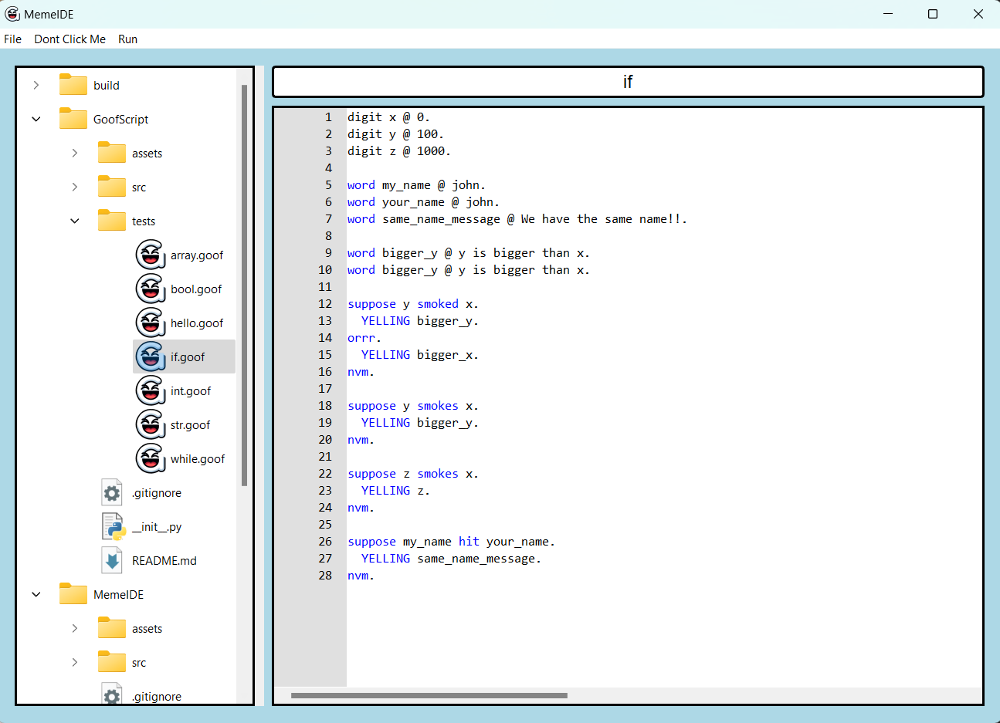

# The Full Goofy Programming Kit

Kit contains language and code editor
Download git repo, run `main.exe` thats it



---

# Custom Programming Language Rules

## Syntax Overview

This document outlines the syntax and basic constructs of a custom programming language designed for simplicity and readability. The language reimagines traditional programming keywords with everyday language concepts.

### Keywords and Operators

- **IF**: `suppose`
- **ELSE**: `orrr`
- **ENDIF**: `nvm`
- **WHILE**: `one_sec`
- **ENDWHILE**: `im_back`
- **FALSE**: `cap`
- **TRUE**: `fax`
- **PRINT**: `YELLING`
- **BOOL**: `???`
- **INT**: `digits`
- **STR**: `word`
- **ARR (Array)**: `tub`
- **NOT_TOKEN**: `not_token`
- **ASSIGNMENT**: `@`
- **PLUS**: `with_sum`
- **MINUS**: `not_so_much`
- **MULTIPLY**: `boost`
- **DIVIDE**: `divy_up`
- **LESS THAN**: `smoked`
- **GREATER THAN**: `smokes`
- **LESS THAN OR EQUAL TO**: `kinda_smoked`
- **GREATER THAN OR EQUAL TO**: `kinda_smokes`
- **NOT EQUAL TO**: `miss`
- **EQUAL TO**: `hit`
- **ARRAY GET**: `pluck`
- **ARRAY APPEND**: `shove`
- **ARRAY POP**: `spill`

### Statement Termination

- **ENDLINE**: `.`
  - Each statement must end with a period (`.`).

### Variable Declaration and Assignment

- Declare an integer variable: `digits x @ 2.`
- Assign a value to a variable: `word name @ hello im bob.`

### Operations

- Addition: `digits add @ 7 with_sum x.`
- Subtraction: `digits subtract @ y not_so_much x.`
- Division: `digits divide @ y divy_up x.`
- Multiplication: `digits multiply @ y boost 8.`

### Arrays

- Declare an array: `tub my_array.`
- Append to an array: `tub my_array shove 1.`
- Access an array element: `digits i @ tub my_array pluck 0.`

### Output

- Print a variable or a literal: `YELLING add.`

## Examples

### Basic Arithmetic

```plaintext
digits x @ 2.
digits y @ 5.

digits add @ 7 with_sum x.
digits subtract @ y not_so_much x.
digits divide @ y divy_up x.
digits multiply @ y boost 8.

YELLING add.
YELLING subtract.
YELLING divide.
YELLING multiply.
```

### Working with Arrays

```plaintext
tub my_array.
word name @ hello im bob.

tub my_array shove 1.
tub my_array shove 10.
tub my_array shove 100.
tub my_array shove name.

digits i @ tub my_array pluck 0.
word bob @ tub my_array pluck 3.

YELLING my_array.
YELLING i.
YELLING bob.
```

This document provides a foundational overview of the syntax and constructs available in the custom programming language. Use it as a guide for writing and understanding programs written in this language.
